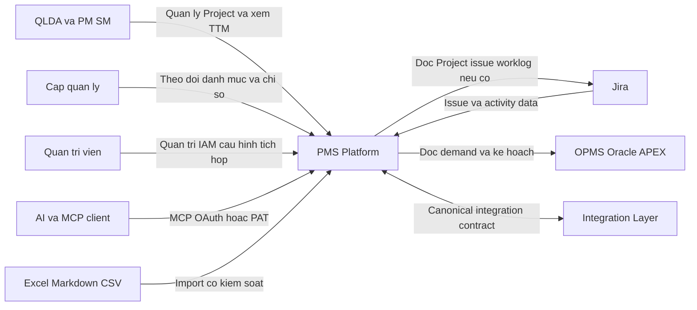
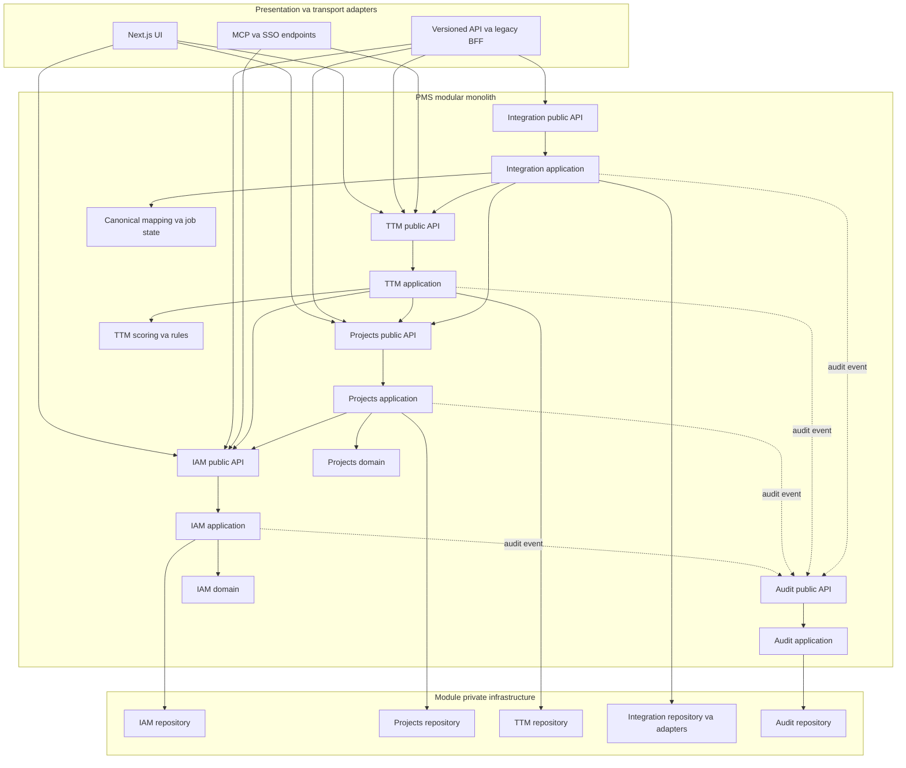
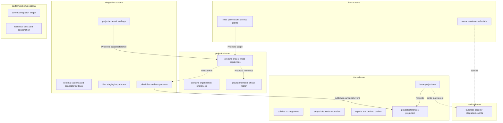
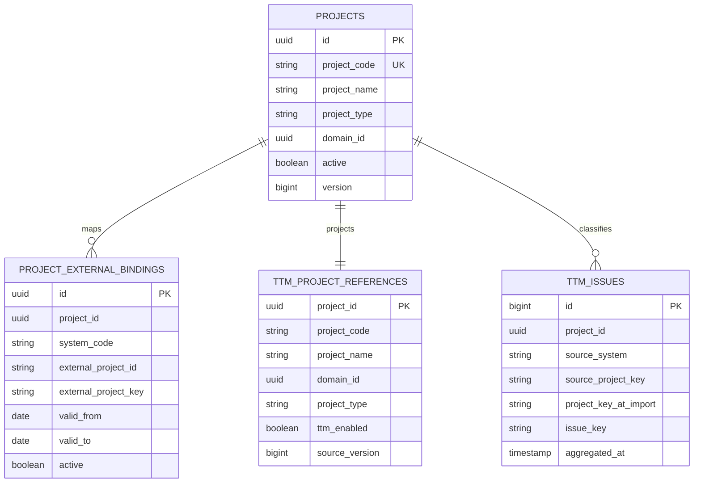
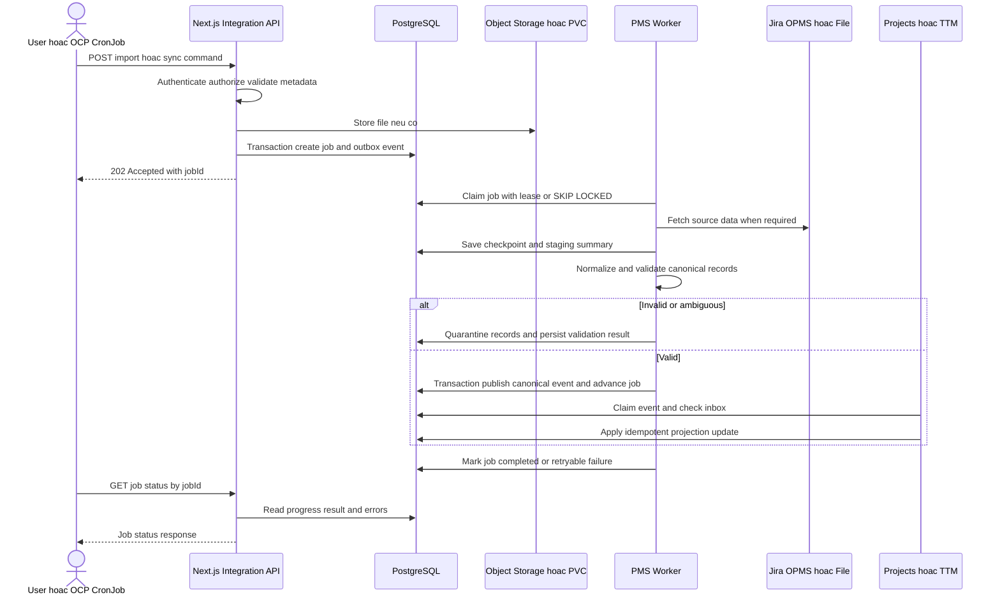
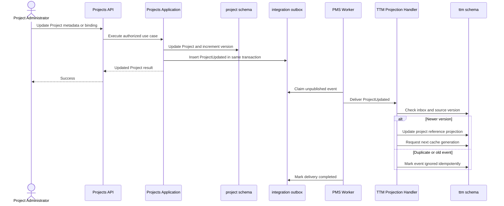
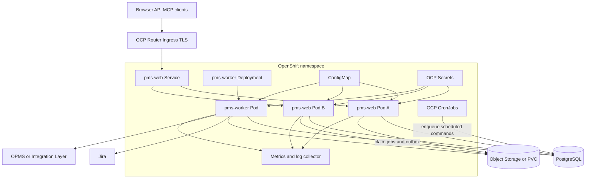
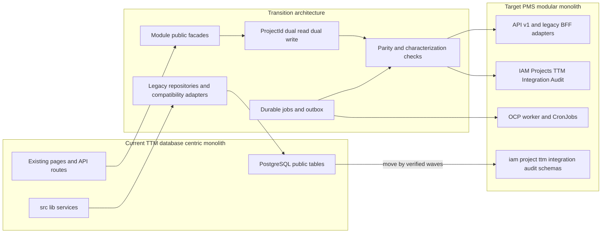

# High-Level Architecture Design — PMS Platform và TTM Module

| Thuộc tính | Giá trị |
|---|---|
| Tài liệu | PMS Platform High-Level Architecture Design |
| Phiên bản | 1.0 |
| Trạng thái | Architecture baseline — kiến trúc mục tiêu, chưa phải mô tả implementation đã hoàn tất |
| Ngày | 2026-10-09 |
| Phạm vi | PMS Platform, Projects bounded context, TTM bounded context và Integration runtime |
| Công nghệ nền | Next.js 16, React 19, TypeScript, PostgreSQL, OpenShift Container Platform |

> **Quy ước đọc tài liệu:** “Hiện tại” mô tả source đang tồn tại trong repository. “Chuyển tiếp” mô tả bridge có thời hạn trong quá trình migration. “Mục tiêu” mô tả trạng thái kiến trúc cần đạt; tên module, schema, API hoặc table ở trạng thái mục tiêu không được hiểu là đã tồn tại trong source.

---

## 1. Mục đích

Tài liệu này là HLAD chính thức cho việc chuyển ứng dụng TTM Monitor hiện tại thành một module trong **Project Management System Platform (PMS Platform)**.

Thiết kế giải quyết bốn mục tiêu:

1. Đưa `Project` từ dữ liệu cấu hình phụ trợ của TTM thành master entity do PMS Projects sở hữu.
2. Giữ TTM vận hành ổn định, không rewrite đồng loạt scoring, import parser, dashboard và report hiện tại.
3. Tạo ranh giới module đủ rõ để mở rộng Projects và có thể tách module thành service trong tương lai.
4. Chuẩn hóa tích hợp Jira/OPMS và xử lý nền bền vững trên OCP.

## 2. Phạm vi và ngoài phạm vi

### 2.1. Trong phạm vi

- Kiến trúc logical modular monolith.
- Module ownership và dependency direction.
- Project identity và external-system binding.
- API/BFF boundary.
- Tích hợp Jira, OPMS, Integration Layer và file.
- Durable job, transactional outbox và OCP runtime.
- PostgreSQL schema ownership.
- Security, observability, consistency và scale path.
- Kiến trúc chuyển tiếp theo Strangler Pattern.
- ADR, risk register và roadmap triển khai.

### 2.2. Ngoài phạm vi

- Thiết kế chi tiết checklist, milestone, Gantt, backlog, risk hoặc cost.
- Chọn payload/API cụ thể của OPMS khi chưa có contract.
- Triển khai source code hoặc migration database trong tài liệu này.
- Tách microservice hoặc database vật lý ngay.
- Thiết kế multi-tenancy.
- Thay thế Scoring Service hiện tại.

## 3. Bối cảnh nghiệp vụ

PMS Platform dự kiến cung cấp module Projects với các extension point:

- Thông tin tổng quan Project/Team Agile.
- Checklist triển khai và giao phẩm.
- Milestone/Gantt cho dự án; backlog quý/tháng cho Team Agile.
- Trạng thái sức khỏe và tiến độ.
- Phạm vi, rủi ro và bottleneck.
- Roster nhân sự chính thức.
- Chi phí và hiệu quả triển khai ở giai đoạn sau.

PMS là source of truth của Project. OPMS cung cấp demand/kế hoạch CNTT đầu vào. Jira cung cấp dữ liệu quan sát nhân sự/thực thi cho Projects và issue data cho TTM. Jira không tự động thay đổi roster chính thức của PMS.

Quy mô ban đầu là một tổ chức, dưới khoảng 1.000 Project và vài trăm user.

## 4. Thuật ngữ

| Thuật ngữ | Ý nghĩa |
|---|---|
| PMS | Project Management System Platform |
| TTM | Module quản trị Time to Market hiện tại |
| ProjectId | UUID nội bộ, bất biến, định danh Project trong PMS |
| Project Code | Mã nghiệp vụ Project trong PMS, không phải Jira Project Key |
| External Binding | Ánh xạ ProjectId với Jira/OPMS hoặc hệ thống ngoài |
| Bounded Context | Ranh giới nghiệp vụ, data ownership và public contract của module |
| BFF | API được tối ưu cho một màn hình hoặc client cụ thể |
| Port | Contract do application/domain định nghĩa để giao tiếp với hạ tầng hoặc module khác |
| Adapter | Implementation của Port cho Jira API, CSV, OPMS, PostgreSQL hoặc HTTP |
| Projection | Read model cục bộ được cập nhật từ event của module khác |
| Outbox | Bảng event được ghi atomically cùng transaction nghiệp vụ |
| Inbox | Bảng chống xử lý lặp event ở consumer |
| Generation | Phiên bản nhất quán của một tập cache/projection |

---

# Phần I — Hiện trạng

## 5. Current-state architecture

Ứng dụng hiện tại là Next.js App Router modular theo file nhưng **database-centric**:

```text
Browser
  -> Next.js page/client component
  -> src/app/api/**/route.ts
  -> src/lib/*-service.ts
  -> shared @/lib/db pool
  -> PostgreSQL public.*
```

Các Route Handler trả JSON và đóng vai trò BFF/REST-like API cho browser. Server-side code có thể gọi service trực tiếp. External caller sử dụng API import, MCP hoặc SSO.

### 5.1. Thành phần đã tồn tại

- Next.js 16 App Router và React 19.
- PostgreSQL qua `src/lib/db.ts`.
- Session/RBAC qua `src/lib/auth-service.ts` và `src/proxy.ts`.
- Project/Domain master hiện tại qua `src/lib/master-data-service.ts`.
- Jira CSV adapters trong `src/lib/adapters/`.
- Import pipeline trong `src/lib/import-service.ts`.
- Legacy TTM engine và Scoring Service trong `src/lib/scoring/`.
- Derived cache orchestration trong `src/lib/daily-cache-service.ts` và các cache service liên quan.
- API/BFF routes tại `src/app/api/`.
- Database bootstrap và migrations tại `db/schema.sql`, `db/migrations/`, `scripts/migrate-db.js`.

### 5.2. Coupling cần loại bỏ dần

1. Nhiều service import chung `@/lib/db`; SQL chưa có module ownership và phần lớn không schema-qualified.
2. `projects.source_project_key` đang đồng thời là Project identity, Jira key, filter key, authorization key và cache key.
3. TTM join trực tiếp `projects`, `domains`, `users`, `user_projects`, `user_domains`, `user_project_components`.
4. Import HTTP gọi trực tiếp parse, validate, insert, snapshot và cache refresh trong cùng request flow.
5. TTM cache chứa hoặc suy ra metadata Project/IAM nên dễ stale khi Project, Domain hoặc membership thay đổi.
6. Migration/bootstrap chưa quản lý module, checksum và multi-schema một cách chặt chẽ.
7. MCP Epic detail cần được củng cố authorization theo Project scope, không chỉ role/feature permission.

### 5.3. Constraints bảo toàn

- Không phá API/UI TTM hiện hành trong giai đoạn đầu.
- Không rewrite scoring hoặc CSV parser.
- Không chuyển toàn bộ table sang schema mới trước khi cắt code dependency.
- Không biến HTTP thành cơ chế gọi nội bộ giữa module trong cùng process.

---

# Phần II — Kiến trúc mục tiêu

## 6. Architecture principles

1. **Modular monolith trước, extraction-ready từ đầu.**
2. **Module owns data and invariants.** Chỉ repository của module được ghi vào schema module đó.
3. **Public contract over shared database.** Module không import infrastructure/repository của module khác.
4. **Stable internal identity.** ProjectId không phụ thuộc key từ Jira/OPMS.
5. **Sync for immediate queries, async for propagation and integration.**
6. **Durable jobs for critical work.** Không dùng lifecycle của HTTP request làm job runtime.
7. **Eventual consistency is explicit.** Projection có version, lag và trạng thái quan sát được.
8. **Compatibility is temporary and measurable.** Bridge có owner, parity gate và tiêu chí loại bỏ.
9. **Schema-qualified SQL.** Không dùng `search_path` làm dependency resolver dài hạn.
10. **Security at use-case boundary.** Menu visibility không thay thế backend authorization.

## 7. System Context diagram



### 7.1. System responsibilities

| System | Trách nhiệm |
|---|---|
| PMS | Project master, roster chính thức, Project capabilities, TTM module, access control và audit |
| Jira | Work item, trạng thái thực thi, assignee/worklog nếu được cung cấp, TTM source issue |
| OPMS | Demand, OKR và kế hoạch CNTT đầu vào |
| Integration Layer | Kênh tích hợp tùy chọn; không thay đổi canonical contract của PMS |
| File channel | Fallback/batch input; phải qua cùng validation và staging như API |

## 8. Logical component/module diagram



### 8.1. Dependency rule

Allowed:

```text
Route or Server Component
  -> module public API
  -> application use case
  -> domain and module-private repository
```

Forbidden:

```text
TTM -> project/infrastructure/project-repository
Projects -> iam/infrastructure/user-repository
Route Handler -> shared pool.query for business transaction
Module A -> direct write into Module B schema
```

Cross-module synchronous calls use public application contracts. Cross-module state propagation uses outbox events and local projections.

## 9. Module ownership

### 9.1. IAM

**Owns:** users, sessions, credentials, roles, capability permissions, domain/project/component grants.

**Public contracts:**

```ts
interface IdentityService {
  getPrincipal(sessionToken: string): Promise<Principal | null>;
}

interface AccessScopeService {
  resolveProjectScope(principal: Principal): Promise<ProjectAccessScope>;
  can(principal: Principal, permission: string, resource?: ResourceRef): Promise<boolean>;
}
```

`ProjectAccessScope` lấy ProjectId làm chuẩn. Trong transition có thể kèm Jira keys để tương thích query cũ.

### 9.2. Projects

**Owns:** organization/domain reference, Project master, Project type, capability activation và roster chính thức.

**Extension points:** checklist, milestone/Gantt, backlog/planning period, health, scope/risk/bottleneck, cost và effectiveness.

**Public contract:**

```ts
interface ProjectCatalog {
  getById(projectId: ProjectId): Promise<ProjectReference | null>;
  getByExternalRef(ref: ExternalProjectRef): Promise<ProjectReference | null>;
  listVisible(scope: ProjectAccessScope): Promise<ProjectReference[]>;
}
```

Projects không sở hữu Jira issue và không dùng Jira assignee làm roster chính thức nếu chưa có xác nhận nghiệp vụ.

### 9.3. TTM

**Owns:** Jira issue projection dùng cho TTM, policy/scope, scoring, alert, anomaly, snapshot/history, reports và derived caches.

TTM không sở hữu Project master. TTM sử dụng:

- ProjectId.
- `ttm.project_references` local projection.
- Access scope do IAM trả về.
- Jira canonical snapshot do Integration phát hành.

### 9.4. Integration

**Owns:** external systems, connector settings, Project external binding, staging, import/sync job, inbox/outbox và connector adapter.

Adapters dự kiến:

- Jira API.
- Jira CSV hiện tại.
- OPMS API trực tiếp.
- OPMS qua Integration Layer.
- OPMS Excel.
- OPMS Markdown.

### 9.5. Audit

**Owns:** immutable business, security và integration audit events.

Audit event tối thiểu có `eventId`, `occurredAt`, `actor`, `action`, `resource`, `projectId`, `correlationId`, `jobId`, kết quả và metadata đã loại secret.

### 9.6. Shared platform

Chỉ chứa technical primitives:

- Database connection factory.
- Clock và ID generator contracts.
- Telemetry/correlation.
- Migration ledger.
- Job coordination primitives.
- Common error envelope.

Không đặt business rule hoặc “service dùng chung” tùy tiện vào Shared platform.

## 10. Recommended source structure

Cấu trúc mục tiêu; chưa tồn tại đầy đủ trong source hiện tại:

```text
src/
  app/
    api/
      v1/
        projects/
        ttm/
        integrations/
        jobs/
      ...legacy-bff-routes

  modules/
    iam/
      domain/
      application/
      infrastructure/
      public.ts
    project/
      domain/
      application/
      infrastructure/
      public.ts
    ttm/
      domain/
      application/
      infrastructure/
      public.ts
    integration/
      domain/
      application/
      infrastructure/
      adapters/
      public.ts
    audit/
      application/
      infrastructure/
      public.ts

  platform/
    db/
    jobs/
    telemetry/
    errors/
```

Route groups có thể được dùng để tổ chức UI mà không đổi URL. Không bắt buộc di chuyển toàn bộ file trong một release; facade được tạo trước, physical move thực hiện sau.

---

## 11. Database schema ownership diagram



### 11.1. Physical FK policy

- FK trong cùng schema được ưu tiên.
- Cross-schema FK có thể được giữ khi đó là invariant mạnh trong cùng database, nhưng phải ghi nhận release coupling.
- History, event và projection ưu tiên lưu ID cùng snapshot metadata thay vì FK cascade.
- Không cascade-delete dữ liệu lịch sử TTM khi Project bị deactivate hoặc external binding thay đổi.

### 11.2. SQL policy

- Repository mới dùng schema-qualified SQL.
- Production DB role không được `CREATE` trong schema không sở hữu.
- Không dùng broad `search_path` làm giải pháp dài hạn.
- Backup/restore allowlist phải sử dụng cặp `(schema_name, table_name)`.

## 12. Project identity model



### 12.1. Identity rules

- `project.projects.id` là UUID bất biến.
- `project_code` là business code do PMS quản lý.
- Jira/OPMS identifiers không được dùng làm primary identity PMS.
- Một Project có thể có nhiều external binding.
- Binding có source system, active period và trạng thái.
- TTM giữ source key để trace và `project_key_at_import` để bảo toàn lịch sử.
- Binding không match hoặc ambiguous phải vào quarantine; không tự chọn ngầm.
- Canonical Jira key được normalize nhất quán, nhưng raw value vẫn được giữ phục vụ audit.

---

## 13. Communication architecture

### 13.1. Browser và external caller

Browser/external caller gọi HTTP API hoặc BFF Route Handler. Backend thực hiện auth, validation, authorization và gọi application use case.

### 13.2. Internal synchronous communication

Trong cùng Node.js process, module gọi public application interface trực tiếp. Không gọi HTTP loopback giữa các module.

### 13.3. Internal asynchronous communication

Producer ghi business state và outbox event trong cùng transaction. Worker relay/consumer claim event, ghi inbox trước hoặc atomically cùng side effect để chống xử lý lặp.

Delivery semantics mặc định là **at-least-once**; consumer bắt buộc idempotent.

### 13.4. Event catalog baseline

| Event | Producer | Consumer chính | Mục đích |
|---|---|---|---|
| `ProjectCreated` | Projects | IAM, TTM, Audit | Tạo reference/projection |
| `ProjectUpdated` | Projects | TTM, Audit | Cập nhật metadata Project |
| `ProjectExternalBindingChanged` | Integration/Projects use case | TTM, Integration | Đổi ánh xạ source key |
| `ProjectMembershipChanged` | Projects/IAM orchestration | IAM, TTM | Cập nhật scope/cache |
| `JiraSnapshotReady` | Integration | TTM, Projects | Cập nhật issue và observation |
| `OpmsDemandImported` | Integration | Projects | Tạo input/draft cho planning |
| `TtmProjectionRefreshRequested` | TTM | TTM worker | Rebuild projection/cache |

Event envelope tối thiểu:

```ts
interface EventEnvelope<T> {
  eventId: string;
  eventType: string;
  eventVersion: number;
  occurredAt: string;
  aggregateId: string;
  aggregateVersion: number;
  correlationId: string;
  causationId?: string;
  payload: T;
}
```

Consumer bỏ qua event đã có trong inbox; event version không hỗ trợ phải bị reject có quan sát, không xử lý im lặng.

---

## 14. Integration architecture

### 14.1. Ports & Adapters

```ts
interface ProjectPlanSourcePort {
  fetchChanges(cursor?: string): Promise<ExternalPlanBatch>;
}

interface JiraObservationSourcePort {
  fetchProjectObservation(binding: ExternalProjectBinding): Promise<JiraObservationBatch>;
}

interface JiraIssueSourcePort {
  fetchIssueSnapshot(binding: ExternalProjectBinding): Promise<JiraIssueBatch>;
}
```

Canonical model nằm trong Integration application/domain. OPMS API, IL, Excel và Markdown chỉ là transport/source adapters. Projects không xử lý trực tiếp Oracle APEX payload hoặc workbook cell.

### 14.2. Staging và validation

Mọi nguồn phải đi qua:

```text
Receive
-> identify source and idempotency key
-> validate transport and content
-> persist staging or object metadata
-> normalize canonical records
-> resolve external bindings
-> quarantine invalid or ambiguous records
-> publish canonical event
```

Raw payload retention phải cấu hình được. Secret và token không được ghi trong raw payload/audit.

## 15. Jira/OPMS asynchronous ingestion sequence



### 15.1. Job state model

```text
QUEUED
-> CLAIMED
-> VALIDATING
-> STAGED
-> APPLYING
-> PUBLISHING
-> COMPLETED
```

Failure states:

```text
FAILED_VALIDATION
RETRY_WAIT
FAILED_TERMINAL
CANCELLED
```

### 15.2. Durability requirements

- `idempotency_key` có unique constraint theo job/source semantics.
- Worker dùng lease/heartbeat hoặc `FOR UPDATE SKIP LOCKED`.
- Crash trước commit không được đánh dấu hoàn tất.
- Crash sau commit có thể phát delivery lặp; inbox đảm bảo consumer idempotent.
- Retry dùng exponential backoff và giới hạn attempt.
- Terminal failure giữ error code an toàn, không lưu token/raw secret.
- Pipeline có checkpoint để không phải chạy lại toàn bộ khi có thể resume an toàn.

---

## 16. Project change to TTM projection sequence



### 16.1. Consistency expectations

- Project command response phản ánh committed Project master.
- TTM Project reference và cache cập nhật eventual-consistently.
- Target projection lag bình thường: dưới 60 giây với worker online.
- UI cần hiển thị last-updated/generation khi nghiệp vụ yêu cầu minh bạch.
- Event out-of-order được xử lý bằng `aggregateVersion/sourceVersion`.

---

## 17. TTM projection and cache architecture

### 17.1. Hot-path rule

Dashboard, reports, Epic list và MCP TTM không live join IAM/Projects trong hot path. TTM query:

- `ttm.project_references`.
- TTM-owned issue projection.
- TTM-owned cache generation.
- ProjectId scope do IAM public API cung cấp hoặc scope snapshot hợp lệ.

### 17.2. Cache generation

```text
Event or command
-> create refresh request with desired generation
-> worker builds generation N+1
-> validate row counts checksums and source versions
-> atomically switch active generation
-> retire old generation by retention policy
```

Không xóa active cache trước khi cache mới được verify.

### 17.3. Coalescing

Nếu nhiều event đến trong lúc build:

- Ghi nhận highest desired source version.
- Một worker giữ refresh lease.
- Sau build, nếu desired version đã tăng thì tạo/rerun generation kế tiếp.
- Không chạy một rebuild cho mỗi event nhỏ nếu kết quả có thể coalesce.

---

## 18. API architecture

### 18.1. Versioned API target

```text
/api/v1/projects/*
/api/v1/ttm/*
/api/v1/integrations/*
/api/v1/jobs/*
```

API sử dụng resource ID nội bộ. External keys được truyền bằng filter hoặc binding resource, không thay ProjectId trong URL chuẩn.

### 18.2. Legacy/BFF compatibility

Các route đang tồn tại tiếp tục được giữ trong transition, gồm:

```text
/api/ttm-dashboard-2
/api/epic-alerts-15
/api/reports
/api/projects
```

Route cũ và API v1 phải gọi cùng application use case; không copy business logic.

### 18.3. Server Components

Server Component được gọi application service trực tiếp khi chạy cùng process. Không bắt buộc đi qua HTTP nội bộ. Client Component và external caller phải đi qua API.

### 18.4. Error envelope

API v1 nên chuẩn hóa:

```ts
interface ApiError {
  code: string;
  message: string;
  correlationId: string;
  fieldErrors?: Array<{ field: string; code: string; message: string }>;
}
```

Không trả stack trace, SQL hoặc secret cho client.

---

# Phần III — Deployment và vận hành

## 19. OCP container/deployment diagram



### 19.1. Workloads

Cùng source repository và image có tối thiểu hai command:

```text
pms-web: Next.js web runtime
pms-worker: durable job and outbox consumer runtime
```

OCP CronJob enqueue scheduled command cho:

- Jira/OPMS periodic sync.
- Cache refresh.
- Retention cleanup.
- Backup.

CronJob là scheduler, không thay thế job state, idempotency và retry trong PostgreSQL.

### 19.2. Next.js multi-pod requirements

- Mọi web pod dùng cùng application build.
- Cấu hình deployment/build ID nhất quán khi dùng rolling deployment.
- Nếu dùng Server Actions, encryption key phải nhất quán giữa pod.
- Không dựa vào in-memory/local pod cache cho business-critical projection.
- Nếu sử dụng Next.js data cache giữa nhiều pod, cần shared cache handler hoặc thiết kế request không phụ thuộc cache cục bộ.
- Graceful shutdown ngừng nhận request/job mới và hoàn tất hoặc nhả lease an toàn.

### 19.3. Health probes

- **Liveness:** process event loop còn hoạt động; không phụ thuộc external systems.
- **Readiness web:** application đã load config và có thể phục vụ request; DB critical dependency được kiểm tra có timeout.
- **Readiness worker:** DB/job store reachable và worker có thể claim lease.
- Jira/OPMS outage không làm web pod liveness fail; được phản ánh qua integration health/metrics.

### 19.4. Reverse proxy

OCP Router/reverse proxy đảm nhiệm TLS, request size limit, timeout và rate limiting lớp biên. Application vẫn phải validate content length/type vì proxy limit không thay thế business validation.

---

## 20. Next.js background work policy

`after()` có thể chạy callback sau response nhưng vẫn bị giới hạn bởi lifecycle/duration của platform route. Vì vậy:

- Được dùng cho logging/analytics ngắn, có thể mất mà không phá invariant.
- Không dùng cho import Jira/OPMS, cache rebuild, backup, retention hoặc event delivery.
- Không dùng in-memory cron/queue trong web pod vì pod có thể restart hoặc scale ngang.
- Durable work phải tạo PostgreSQL job/outbox trước khi trả response.

Tham khảo chính thức: [Next.js `after`](https://nextjs.org/docs/app/api-reference/functions/after), [Next.js self-hosting and multi-instance cache](https://nextjs.org/docs/app/guides/self-hosting), [Kubernetes CronJob](https://kubernetes.io/docs/concepts/workloads/controllers/cron-jobs/).

## 21. Security architecture

### 21.1. Authentication and authorization

- Authentication tiếp tục được enforce tại backend.
- Authorization được kiểm tra tại application use-case boundary.
- Permission được mô hình hóa theo capability và resource scope:

```text
projects.read
projects.manage
projects.members.manage
ttm.dashboard.read
ttm.epics.read
ttm.import.execute
ttm.policy.manage
integration.manage
```

- Scope chuẩn là ProjectId, có thể GLOBAL, DOMAIN, PROJECT hoặc COMPONENT.
- Feature/menu permission chỉ điều khiển khả năng nhìn chức năng, không thay resource authorization.
- MCP/API Epic detail phải resolve ProjectId và kiểm tra scope trước khi trả dữ liệu.

### 21.2. Database security

- Mỗi module có DB role/grant phù hợp nếu khả thi trong runtime/migration model.
- Repository mới dùng schema-qualified object name.
- Revoke broad `CREATE` trên schema production đối với application role.
- Migration role tách application runtime role.
- Cross-schema write không được cấp mặc định.

### 21.3. Secret management

- Jira/OPMS/API credentials lưu trong OCP Secret hoặc secret manager được tổ chức phê duyệt.
- Secret có owner, rotation và expiration policy.
- Không log token, password, authorization code, raw secret hoặc connection string.
- Outbox/audit chỉ lưu secret reference khi cần, không lưu secret value.

### 21.4. Upload security

- Giới hạn kích thước tại Router và application.
- Validate extension, MIME hint, signature/content và row/record count.
- Formula injection safety cho Excel/CSV export-import.
- Malware scan nếu hạ tầng cho phép.
- Filename không được dùng trực tiếp làm filesystem path.
- File retention và deletion policy riêng với database retention.

### 21.5. Audit requirements

Audit tối thiểu:

- Login success/failure và session/security event.
- Permission/grant changes.
- Project create/update/deactivate và membership change.
- External binding/config/secret rotation metadata.
- Integration job start/result/retry/cancel.
- TTM policy/scoring mode/rule changes.
- Backup, restore và purge.

---

## 22. Non-functional architecture

### 22.1. Availability and scale path

Baseline phục vụ dưới 1.000 Project và vài trăm user bằng:

- Nhiều web pod stateless.
- Một hoặc nhiều worker pod.
- PostgreSQL durable source.
- Server-side pagination/filter.
- Projection/cache cho TTM hot path.

Scale path:

1. Tăng web/worker replica độc lập.
2. Bổ sung read replica/reporting store khi cần.
3. Partition bảng issue/snapshot/job theo thời gian nếu volume yêu cầu.
4. Tách Integration hoặc TTM thành service khi deployment/team/scale boundary rõ.
5. Thay JobQueue port bằng Kafka/RabbitMQ nếu PostgreSQL queue không còn đáp ứng throughput.

### 22.2. Consistency and transactions

- Transaction không vượt module boundary ở trạng thái mục tiêu.
- Thay đổi state và outbox event cùng transaction.
- Cross-module update là eventual consistency.
- API không tuyên bố projection đã cập nhật nếu mới chỉ commit master state.
- UI/job API cung cấp trạng thái `pending`, `completed`, `failed` khi người dùng cần theo dõi.

### 22.3. Performance

- Index tất cả FK/logical key thường lọc, đặc biệt ProjectId, job status/schedule, external binding và generation.
- Không live join cross-module trong TTM hot path.
- Report/query lớn chạy server-side và có pagination.
- Job xử lý chunk/checkpoint, tránh transaction quá dài.
- Cache build theo generation và atomic switch.

### 22.4. Observability

Mọi HTTP request/job/event mang correlation metadata:

```text
correlationId
requestId
jobId
eventId
projectId
sourceSystem
cacheGeneration
```

Metrics tối thiểu:

- API latency, throughput và error rate.
- Queue depth và oldest-job age.
- Job duration, retry, terminal failure và timeout.
- Import rows read/valid/invalid/quarantined.
- Inbox/outbox lag.
- TTM projection lag.
- Cache active/desired generation và build duration.
- DB pool saturation, slow query và lock wait.

Logs là structured logs, không chứa PII/secret quá mức cần thiết.

### 22.5. Backup, restore and DR

- Backup bao phủ toàn bộ schema và dependency order.
- Restore runbook nêu rõ extension, sequence, FK, grants và schema ownership.
- Object storage/PVC file có backup/retention tương ứng.
- Định kỳ thực hiện restore rehearsal trên môi trường cô lập.
- RPO/RTO cần được business và infrastructure owner phê duyệt; HLAD không tự giả định giá trị.

---

# Phần IV — Kiến trúc chuyển tiếp

## 23. Strangler migration diagram



## 24. Migration strategy

### Phase 0 — Baseline

- Characterization tests cho API, scope, report, cache và integration.
- Security tests cho Project-level access và MCP Epic detail.
- Lập table ownership và SQL dependency inventory.
- Không đổi behavior.

**Exit gate:** behavior quan trọng của TTM có test; ownership inventory được review.

### Phase 1 — Module boundaries, DB vẫn ở `public`

- Tạo module skeleton và `public.ts`.
- Enforce dependency lint.
- Bọc service hiện tại bằng facade.
- Chưa move table.

**Exit gate:** route/module mới không import infrastructure module khác; regression test đạt.

### Phase 2 — Thin routes and repositories

- Đưa transaction/business orchestration khỏi Route Handler.
- Tạo module-private legacy repository.
- Chuẩn hóa errors/DTO ở boundary.

**Exit gate:** không còn direct business SQL trong các route ưu tiên; API contract không đổi.

### Phase 3 — ProjectCatalog và AccessScope

- Tạo ProjectCatalog facade trên table hiện tại.
- IAM sở hữu tính access scope.
- TTM nhận scope/Project reference qua contract.
- Sửa MCP/API resource authorization.

**Exit gate:** scope parity đạt; IDOR tests đạt.

### Phase 4 — ProjectId and external bindings

- Add ProjectId và binding tables theo expand migration.
- Backfill có báo cáo unmatched/ambiguous/case conflict.
- Dual-write/dual-read.
- Parity giữa Jira-key path và ProjectId path.

**Exit gate:** không còn ambiguous chưa xử lý trong tập cutover; parity đạt ngưỡng được phê duyệt.

### Phase 5 — Durable Integration runtime

- Tạo job/outbox/inbox.
- Route trả `202 + jobId`.
- Worker/CronJob xử lý import/sync.
- Giữ parser/validator hiện tại qua adapter.

**Exit gate:** crash/retry/idempotency tests đạt; import không phụ thuộc HTTP lifetime.

### Phase 6 — Event-driven TTM projection/cache

- Tạo TTM Project reference projection.
- Project/IAM/integration changes phát event.
- Cache dùng generation và build-then-swap.

**Exit gate:** projection lag được quan sát; failed build không phá active cache.

### Phase 7 — Migration framework and multi-schema

- Migration ledger có module/version/checksum/status.
- Fresh-init từ migration được kiểm chứng.
- SQL mới schema-qualified.
- Move table theo wave, leaf tables trước.

**Exit gate:** fresh DB và upgraded DB có cùng inventory; backup/restore multi-schema đạt.

### Phase 8 — API v1 and cutover

- Thêm API v1.
- Route cũ làm compatibility BFF.
- Loại compatibility khi không còn consumer.
- Xóa `search_path` bridge và cross-module direct SQL còn lại.

**Exit gate:** end-to-end TTM đạt; consumer inventory xác nhận bridge có thể gỡ.

### 24.1. Compatibility constraints

- Compatibility read view chỉ là giải pháp tạm thời.
- Không dùng generic updatable view cho write path có `ON CONFLICT`.
- Legacy write phải đi qua facade, stored procedure hoặc adapter có chủ đích.
- Mỗi bridge phải có owner, metric consumer và removal criterion.
- Không đánh dấu migration thành công chỉ vì object đã tồn tại; phải verify expected definition.

---

# Phần V — Architecture Decision Records

## ADR-001 — Modular monolith, chưa dùng microservices

**Context:** Quy mô hiện tại chưa cần independent scaling/deployment cho từng module; team cần giảm rủi ro thay đổi TTM.

**Decision:** Một codebase và deployment family, module boundary được enforce trong source. Web và worker là workload khác command nhưng dùng chung source/image.

**Consequences:** Transaction và vận hành đơn giản hơn microservices; cần lint/test/review chặt để boundary không thoái hóa. Có thể tách service sau khi public contract và data ownership ổn định.

## ADR-002 — Một PostgreSQL database, schema ownership theo module

**Context:** Tách database ngay làm tăng distributed transaction, reporting và vận hành.

**Decision:** Dùng một PostgreSQL database với `iam`, `project`, `ttm`, `integration`, `audit`; `platform` tùy chọn cho migration/coordination kỹ thuật.

**Consequences:** Dễ backup/report hơn và phù hợp quy mô; cross-schema FK/query có thể tạo release coupling nên phải kiểm soát bằng grant và repository ownership.

## ADR-003 — ProjectId nội bộ tách external keys

**Context:** `source_project_key` hiện mang cả identity, integration, authorization và cache semantics.

**Decision:** ProjectId UUID là identity bất biến. Jira/OPMS keys nằm trong external binding có source và active period.

**Consequences:** Hỗ trợ nhiều binding và rename; cần backfill, quarantine và dual-read migration. TTM phải mang thêm ProjectId nhưng giữ source key để trace.

## ADR-004 — Ports & Adapters cho integration

**Context:** Kênh OPMS chưa chốt; Jira hiện có CSV nhưng có thể chuyển API.

**Decision:** Canonical ports thuộc Integration module; API, IL, CSV, Excel và Markdown là adapters.

**Consequences:** Projects/TTM không phụ thuộc transport; cần canonical mapping/version và validation rõ. Adapter vẫn phải xử lý khác biệt nguồn.

## ADR-005 — Transactional outbox và PostgreSQL durable jobs

**Context:** Import/cache hiện gắn với HTTP lifecycle; OCP có worker và CronJob, chưa cần broker riêng.

**Decision:** PostgreSQL job/outbox/inbox là durable coordination ở giai đoạn đầu. Worker OCP xử lý asynchronous work.

**Consequences:** Không cần Kafka/RabbitMQ ban đầu; delivery at-least-once yêu cầu idempotent consumer, cleanup/index/monitoring job tables và tránh tạo tải quá mức lên PostgreSQL.

## ADR-006 — TTM dùng local Project reference projection

**Context:** Live joins TTM với Project/IAM làm hot path chậm và coupling cache.

**Decision:** TTM giữ `ttm.project_references`, cập nhật bằng versioned event. IAM trả ProjectId scope.

**Consequences:** Hot path độc lập và extraction-ready; metadata có eventual consistency nên phải đo projection lag và xử lý event out-of-order.

## ADR-007 — Strangler migration và giữ API TTM hiện tại

**Context:** Rewrite đồng loạt có rủi ro regression cao và khó rollback.

**Decision:** Facade, dual-read/write, parity và compatibility BFF được dùng trong transition. Physical table move thực hiện sau code boundary.

**Consequences:** Tồn tại tạm hai path và tăng complexity migration; mỗi bridge cần removal criteria để tránh trở thành permanent legacy.

## ADR-008 — Không dùng Next.js `after()` cho durable jobs

**Context:** `after()` vẫn phụ thuộc platform invocation duration và không cung cấp queue state/retry sau pod crash.

**Decision:** Chỉ dùng `after()` cho side effect ngắn, không critical. Import, sync, cache, retention và backup chạy qua durable job/worker.

**Consequences:** Thêm worker workload và job monitoring; đổi lại có retry, idempotency, checkpoint và khả năng phục hồi rõ ràng.

---

# Phần VI — Risk Register

## 25. Architecture risks

| ID | Risk | Tác động | Mitigation | Dấu hiệu kiểm chứng |
|---|---|---|---|---|
| R-01 | Regression TTM khi cắt Project/IAM joins | Sai quyền, dashboard hoặc report | Characterization tests, facade trước, dual-read và parity | API snapshot và chỉ số cũ/mới khớp; không tăng 403/500 bất thường |
| R-02 | Jira key ambiguous/case-sensitive | Gán sai Project hoặc mất scope | Canonical normalization, unique rule theo source, quarantine và manual resolution | Báo cáo unmatched/ambiguous bằng 0 trước cutover hoặc có waiver rõ |
| R-03 | Projection/cache stale | UI hiển thị metadata/chỉ số cũ | Source version, projection lag metric, generation build-then-swap | Active generation đạt desired version trong SLO |
| R-04 | Event out-of-order hoặc duplicate | Projection quay về dữ liệu cũ | Inbox, aggregate version và idempotent handler | Test event đảo thứ tự/lặp không đổi kết quả cuối |
| R-05 | Long migration/table lock | Downtime hoặc request timeout | Expand-contract, chunk backfill, lock timeout, migration rehearsal | Lock duration trong ngưỡng; rollback/runbook được diễn tập |
| R-06 | Job duplicate hoặc worker crash | Duplicate batch, score/cache sai | Unique idempotency key, lease, checkpoint, inbox/outbox | Kill-worker test resume an toàn; không có duplicate canonical batch |
| R-07 | Cross-schema FK tạo release coupling | Module không deploy/migrate độc lập | Phân loại invariant, giảm FK lịch sử/projection, dependency-ordered migration | Schema dependency report được review mỗi release |
| R-08 | Backup/restore chưa hỗ trợ schema | Không phục hồi đủ dữ liệu | Multi-schema allowlist, restore rehearsal, grants/sequences validation | Restore test cho row count, FK, sequence và permission đạt |
| R-09 | Multi-pod Next.js cache inconsistency | Pod trả response khác nhau | Shared cache handler nếu dùng, business projection ở PostgreSQL | Cross-pod test cho cùng request trả generation nhất quán |
| R-10 | Scope/IDOR qua API hoặc MCP | Lộ dữ liệu Project | Authorization ở use case, ProjectId scope, negative security tests | User ngoài scope bị từ chối trên UI/API/report/MCP |
| R-11 | OPMS contract chưa chốt | Rework adapter/canonical mapping | Port ổn định, adapter riêng, contract version, fixtures | Thay adapter không đổi Projects/TTM application contract |
| R-12 | PostgreSQL queue ảnh hưởng OLTP | Tăng latency toàn hệ thống | Index queue, claim batch nhỏ, retention, separate worker pool | Queue query/lock metrics và DB latency nằm trong SLO |
| R-13 | Compatibility bridge tồn tại lâu | Kiến trúc tiếp tục coupling | Owner, usage metric, deadline và removal gate | Consumer count về 0 trước khi bridge bị xóa |
| R-14 | File upload không an toàn | DoS, malware, CSV/formula injection | Size/content validation, storage isolation, scan và retention | Security test và audit upload đạt |

---

# Phần VII — Roadmap triển khai

## 26. Increment roadmap

Mỗi increment phải demo được, test-driven và không tạo code mồ côi.

### Increment 1 — Architecture baseline và characterization/security tests

**Mục tiêu:** Khóa behavior TTM hiện tại và lập ownership inventory.

**Validation gate:** API/scope/report/cache tests đạt; negative tests cho MCP/API Project scope đạt.

**Demo outcome:** Chạy test chứng minh behavior hiện tại được bảo vệ trước migration.

### Increment 2 — Module skeleton và dependency enforcement

**Mục tiêu:** Tạo module public API và cấm cross-module infrastructure import.

**Validation gate:** Architecture lint phát hiện import trái phép; regression suite đạt.

**Demo outcome:** TTM chạy không đổi; dependency vi phạm bị CI chặn.

### Increment 3 — Thin routes và application transactions

**Mục tiêu:** Route chỉ làm HTTP concern; transaction nằm trong use case.

**Validation gate:** API contract tests và rollback tests đạt; route ưu tiên không query business table trực tiếp.

**Demo outcome:** API cũ trả cùng response qua application service mới.

### Increment 4 — Project Core contract và compatibility adapter

**Mục tiêu:** ProjectCatalog che giấu storage hiện tại.

**Validation gate:** Contract/parity tests giữa legacy lookup và facade đạt.

**Demo outcome:** TTM đọc Project qua ProjectCatalog nhưng DB vẫn ở `public`.

### Increment 5 — IAM AccessScope contract và scope fix

**Mục tiêu:** Tập trung resource authorization theo ProjectId; sửa MCP/API scope.

**Validation gate:** Role/domain/project/component matrix và IDOR tests đạt.

**Demo outcome:** Cùng một principal nhận kết quả scope nhất quán trên UI/API/report/MCP.

### Increment 6 — ProjectId và external binding expand migration

**Mục tiêu:** Thêm identity nội bộ và external bindings không phá key cũ.

**Validation gate:** Backfill report, unique/ambiguous tests và migration smoke tests đạt.

**Demo outcome:** Project PMS có UUID, map được một/nhiều Jira key và API cũ vẫn hoạt động.

### Increment 7 — TTM dual-read, Project projection và parity

**Mục tiêu:** Chuyển scope/cache/report sang ProjectId có kiểm soát.

**Validation gate:** Jira-key path và ProjectId path khớp trên dataset đại diện.

**Demo outcome:** Đổi external binding không làm mất lịch sử hoặc quyền TTM.

### Increment 8 — Canonical integration và durable job/outbox

**Mục tiêu:** Tách source transport khỏi Projects/TTM và trả `202 + jobId`.

**Validation gate:** Atomicity, retry, duplicate, idempotency và state transition tests đạt.

**Demo outcome:** Jira CSV hiện tại chạy qua job durable; retry không tạo duplicate batch.

### Increment 9 — OCP web/worker/CronJob deployment

**Mục tiêu:** Tách web workload và background worker runtime.

**Validation gate:** Multi-worker claim, crash recovery, graceful shutdown và CronJob duplicate tests đạt.

**Demo outcome:** Kill worker giữa job; pod mới tiếp tục/retry an toàn.

### Increment 10 — Event-driven cache generation

**Mục tiêu:** Project/TTM changes cập nhật projection/cache qua event và build-then-swap.

**Validation gate:** Duplicate/out-of-order event, failed build và generation parity tests đạt.

**Demo outcome:** Project change tạo generation mới mà active cache không gián đoạn.

### Increment 11 — Migration framework và schemas

**Mục tiêu:** Module-aware migration ledger, checksum, fresh-init và schema-qualified SQL.

**Validation gate:** Fresh DB và upgraded DB có cùng inventory; checksum mismatch bị phát hiện.

**Demo outcome:** Dựng DB mới và upgrade DB hiện có tới cùng schema version.

### Increment 12 — Physical table move theo wave

**Mục tiêu:** Chuyển table sang schema owner, leaf trước, core sau.

**Validation gate:** Row count/checksum, FK/index/sequence/grant, API regression và restore tests đạt mỗi wave.

**Demo outcome:** Một nhóm table rời `public` trong khi màn TTM liên quan không đổi behavior.

### Increment 13 — API v1 và legacy BFF compatibility

**Mục tiêu:** Cung cấp namespace mới mà không phá frontend cũ.

**Validation gate:** Contract tests API v1 và compatibility tests route cũ/mới đạt.

**Demo outcome:** UI cũ và client API v1 gọi cùng use case, trả cùng business result.

### Increment 14 — Final cutover, observability và DR

**Mục tiêu:** Gỡ temporary bridge, hoàn thiện metrics/runbook/backup và dependency enforcement.

**Validation gate:** End-to-end Project binding -> Jira import -> TTM scoring -> dashboard; restore rehearsal và OCP rolling deployment đạt.

**Demo outcome:** Project thay đổi trong PMS, Jira sync chạy async, TTM projection/cache cập nhật và không có cross-module repository access.

---

# Phần VIII — Governance và validation

## 27. Architecture fitness functions

CI/CD nên kiểm tra:

1. Module khác chỉ import từ `public.ts`.
2. Domain không import Next.js, PostgreSQL hoặc infrastructure.
3. Route Handler không import DB pool cho business transaction.
4. Repository mới chỉ query schema được sở hữu hoặc compatibility allowlist có expiry.
5. Event schema có version và compatibility test.
6. Project-scoped use case có authorization negative test.
7. Migration có checksum và fresh-init test.
8. Cache/projection có source version/generation.

## 28. Definition of Done cho migration increment

Một increment chỉ hoàn tất khi:

- Test gate đạt.
- Demo outcome chạy được.
- Có rollback hoặc roll-forward procedure.
- Metrics/log cần thiết đã có.
- Compatibility bridge mới có owner và removal criterion.
- HLAD/ADR được cập nhật nếu quyết định thay đổi.
- Không chứa secret hoặc copy `.env.local` vào tài liệu/log.

## 29. Open decisions

Các quyết định chưa chốt không chặn architecture baseline:

| ID | Quyết định còn mở | Thời điểm cần chốt |
|---|---|---|
| O-01 | OPMS qua API trực tiếp, IL, Excel hay Markdown | Trước khi triển khai OPMS production adapter |
| O-02 | Dùng custom PostgreSQL queue hay thư viện PostgreSQL-backed đã phê duyệt | Trước Increment 8 |
| O-03 | Object Storage hay PVC cho file staging | Trước Increment 8/9 |
| O-04 | DB role riêng mỗi module hay một runtime role với grant hạn chế | Trước Increment 11 |
| O-05 | Cross-schema FK nào được giữ dài hạn | Trong ownership review trước mỗi table wave |
| O-06 | Shared Next.js cache handler có cần thiết hay business API luôn no-store/projection-backed | Trước scale nhiều web pod production |
| O-07 | RPO/RTO | Trước production readiness review |

## 30. Source references

### Repository

- `src/proxy.ts` — session và feature permission gate.
- `src/lib/auth-service.ts` — current IAM và Project grant coupling.
- `src/lib/master-data-service.ts` — current Project/Domain/PM-SM read model.
- `src/lib/import-service.ts` — current synchronous ingestion, snapshot và cache orchestration.
- `src/lib/daily-cache-service.ts` — current cache lease/refresh behavior.
- `src/lib/epic-alert-service.ts` — current Project scope và TTM read coupling.
- `src/lib/scoring/` — TTM pure scoring core cần bảo toàn.
- `src/lib/adapters/` — current Jira CSV parser adapters.
- `src/app/api/` — current BFF/API Route Handlers.
- `db/schema.sql`, `db/migrations/`, `scripts/migrate-db.js` — current database lifecycle.
- `brd/00-ai-agent-index.md`, `brd/05-auth-rbac-user-management.md`, `brd/07-data-source-and-csv-import.md`, `brd/08-data-model.md`, `brd/15-mcp-sso-and-reports.md` — BRD liên quan.

### Official external references

- [Next.js `after` API](https://nextjs.org/docs/app/api-reference/functions/after)
- [Next.js self-hosting](https://nextjs.org/docs/app/guides/self-hosting)
- [Kubernetes CronJob](https://kubernetes.io/docs/concepts/workloads/controllers/cron-jobs/)
- [PostgreSQL schemas and search path](https://www.postgresql.org/docs/current/ddl-schemas.html)

Nội dung tham khảo bên ngoài đã được diễn giải lại, không sao chép nguyên văn.

---

## 31. Approval

Tài liệu này là baseline để review kiến trúc. Việc bắt đầu migration cần phê duyệt tối thiểu các nội dung:

- Module ownership.
- ProjectId/external binding model.
- Eventual consistency và projection lag.
- OCP web/worker/CronJob runtime.
- Migration phase order.
- Security/resource authorization model.
- Open decisions có thời hạn chốt.
